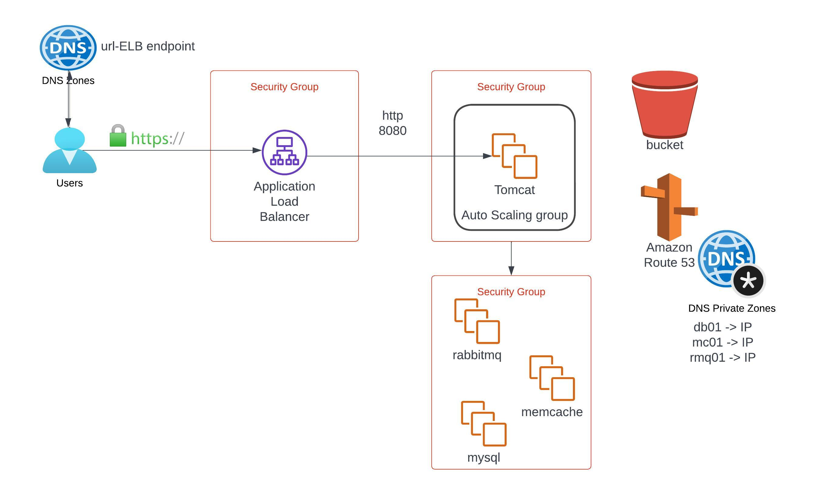

# AWS basic web architecture using EC2 instances

## Infra Setup:
   	1. Register a domain from Godaddy.
	2. Issue a certificate from AWS ACM and add cname values to Godaddy domain.
	3. Login to AWS.
	4. Create key pair.
	5. Create SGs for ELB, Tomcat server and backend servers (memcache, mysql, rabbitMQ).
	6. Launch EC2 instances for all services.
	7. Update IP to name mapping in Route 53 for backend services (using private zone)
	8. Build the application from source code.
	9. Upload the artifactory to S3.
	10. Download the artifact to tomcat instance.
	11. Setup ELB with HTTPS (cert from Amazon Certificate Manager)
	12. Map ELB enbdpoint website name in Godaddy DNS.
	13. Verify.
    14. Build autoscaling group for tomcat instances.

## Screenshots

